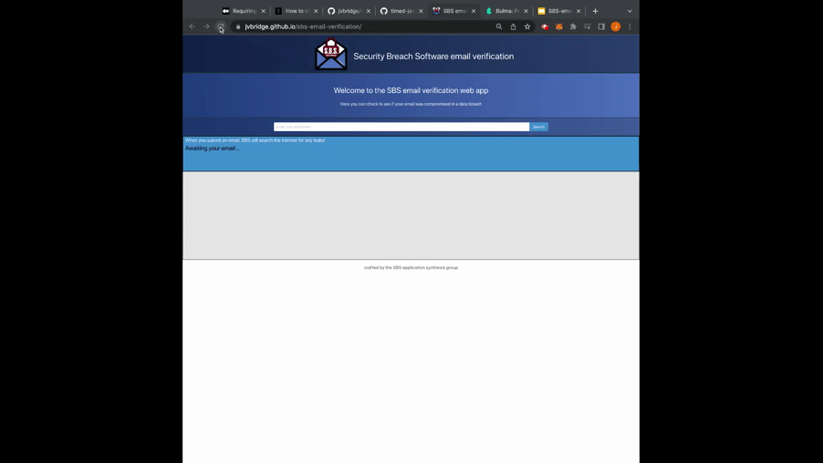

# sbs-email-verification
A web app that detects if your email has been leaked and the reputation it may have online

|   Languages   | Used      |  Libraries   | Used      |   APIs   | Used      |
| ----------- | ----------- | ----------- | ----------- | ----------- | ----------- |
| HTML      |   ✅           | jQuery      |   ✅        | Abstract     |   ✅        |
| CSS  |    ✅               | SweetAlert  |    ✅       | HaveIBeenPwned  |    ✅    |
| JavaScript  |    ✅        | SitePoint   |     ✅     |                  |         |     
|           |                | Bulma       |      ✅    |                   |       |

## Description

This is a web app that takes a given email and returns whether the email has been leaked, or lost, and some basic information about said email. 

## Table of Contents

* [Installation](#installation)
* [Usage](#usage)
* [Development](#development)
* [Credits](#credits)
* [License](#license)

## Installation

The page is currently hosted at: 

https://jvbridge.github.io/sbs-email-verification/

If you wish to host it yourself you can download the files and put them on your webserver of choice.

## Usage

Type your email, or an email you wish to know more about into the main box and 
the results will be displayed on the page. Basic inormation about the email is retrieved from Abstract, one of our third-party APIs, including if it originated from a free or even a disposable email provider, if the email is for a role rather than an individual, if the email is a catchall for its domain, or if it passes an SMTP check. Beyond this, our other API, HaveIBeenPwned, returns information if the email was found to be included in a known data breach. The information will include the company that was breached, the date the breach, and a description that details the breach. 

## Usage preview

## Development

There were several objectives with this project, including, but not limited to, developing good practices for programming in a team environment, developing our ability to work with data fetched from third-party APIs, further practice with using jQuery to dynamically render elements on a web page, exploring how to use css frameworks, and also including animations into our web pages. Working in a team environment presented many aspects to programming that had to be addressed. Beyond collaborating to agree on a direction for our project, we also had to figure out how to come up with agreements that would optimize our workflow and productivity. We came up with working agreements to handle how we would format our html and js files, how we would include comments and the use of intellisense within our code, and how long we would be stuck with a problem before reaching out to teammates, despite encouraging an open and collaborative environment in general. We also had to establish our approach to working on branches, how often we would be making commits, and what the protocol was for requesting pulls and confirming merges. Overall, this project provided a lot of learning opportunities, and it was certainly rewarding to build something with such awesome individuals!

### Credits

Programmers: 

Jonathan Bridge: http://github.com/jvbridge

Julius Canales: https://github.com/stormiestcampfire

Caitlin Lindauer: https://github.com/CL2731

Jake Walsh: https://github.com/jkwalsh127

technologies used:
* jquery: https://jquery.com/
* sweet alert https://sweetalert2.github.io/
* have I been pwned API: https://haveibeenpwned.com/API/v3
* abstract API email validation: https://www.abstractapi.com/email-verification-validation-api
* typewriter animation effect guide: https://www.sitepoint.com/css-typewriter-effect/
* bulma css framework: https://bulma.io/

### License

MIT

Copyright 2022 

Permission is hereby granted, free of charge, to any person obtaining a copy of this software and associated documentation files (the "Software"), to deal in the Software without restriction, including without limitation the rights to use, copy, modify, merge, publish, distribute, sublicense, and/or sell copies of the Software, and to permit persons to whom the Software is furnished to do so, subject to the following conditions:

The above copyright notice and this permission notice shall be included in all copies or substantial portions of the Software.

THE SOFTWARE IS PROVIDED "AS IS", WITHOUT WARRANTY OF ANY KIND, EXPRESS OR IMPLIED, INCLUDING BUT NOT LIMITED TO THE WARRANTIES OF MERCHANTABILITY, FITNESS FOR A PARTICULAR PURPOSE AND NONINFRINGEMENT. IN NO EVENT SHALL THE AUTHORS OR COPYRIGHT HOLDERS BE LIABLE FOR ANY CLAIM, DAMAGES OR OTHER LIABILITY, WHETHER IN AN ACTION OF CONTRACT, TORT OR OTHERWISE, ARISING FROM, OUT OF OR IN CONNECTION WITH THE SOFTWARE OR THE USE OR OTHER DEALINGS IN THE SOFTWARE.
